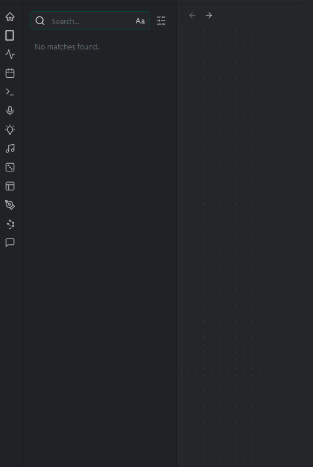

# Google Drive Search

A plugin that implements search over Google Drive files in addition to the default global search.

## Usage

Use the global search and press enter in the search field (the plugin reacts on keypress Enter), first 10 results would be from Google Drive sorted by last time accessed. You can click on the result to open the file in browser.

## Disclosures
This plugin:

- Requires network to access the remote files.
- Requires access to **your Google Drive** (outside of the Obsidian vault, read as full read access to all your GDrive files and files shared with you) to provide you search results. I recommend to manually build and deploy the plugin for privacy reasons (to be sure what you're installing).

## Installation

Either use BRAT or take files from the release and manually put them into the plugins folder of your Obsidian vault (.obsidian/plugins/gdrive-search).

To obtain your Google API key do the same as https://yukigasai.github.io/obsidian-google-calendar/Setup, but:
- Use Google Drive API instead of Calendar API
- Choose Desktop app instead of Web app
- Do not set Authorized redirect URIs and Authorized JavaScript origins (doesn't matter what you set)
- After that - go to settings, enter your client ID and client secret, click auth button, open the URL and follow the authentication process
- You can check your credentials after that using Verify button

## Known bugs

If you scroll down the search results, google drive would disappear. This is because Obsidian redraws the virtual display and I have no idea yet where the actual results are stored. If you know - please tell me. Thx.

## Spoiler

No guarantees provided. This is pretty much an abomination and potentially (almost certainly) might break some other plugins, themes, or experiences. Be aware of it.
Pull requests are welcome, especially in the results representation part.
